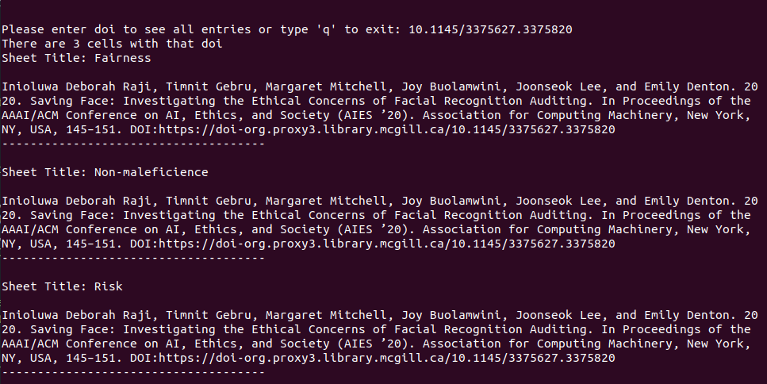

# find-duplicate-DOI

This is another quick n dirty script that I wrote to find and merge duplicate document entries in a spreadsheet based off each document's DOI. 

## About

### Why Does This Exist?

During the summer of 2020, I worked at McGill University's Responsible Autonomy & Intelligent System Ethics (RAISE) Lab. Wherein, I worked on a scoping review. I knew that there were likely duplicate items in the spreadsheet so I needed to write a program to find the duplicates and eliminate them.

### What Does It Do?

This script reads in an `.xlsx` file and reads the B and C columns of each sheet. In each non-empty cell, the script uses a regex to check and see if the cell contains a DOI. That DOI is then isolated and added to a hashtable that keeps track of the occurrences of each DOI. Once the spreadsheet has been read, a copy of the sheet is made and the script overwrites the duplicates cells with an empty cell. This is done to preserve the general shape of the sheet so that its still easy to find items.

## Make This Script Work For You

Since I wrote this as a quick and dirty solution to merge duplicate DOIs, the script is brittle. If you want to use it to merge your own duplicate DOIs -- or other identifiable traits -- you need to do the following:

* Edit the `col` iterator to reflect which columns you want the script to read. 
  * Tip: Indexing starts at 0, so column A is 0, column B is 1, and so on.
*  Edit the `row` iterator to reflect which rows you want the script to read. This script starts at row 5 since rows 1-4 are header in my sheet.
  * Tip: Indexing starts at 0, so row 1 is 0, row 2 is 1, and so on.
* Edit the inside of both `.search(...)` methods. 
  * Refer to the [python3 documentation on regex](https://docs.python.org/3/library/re.html) 

### How to Run This Script

1. Get a copy of the repository locally repository
2. If you are on ubuntu ensure that you are using `pip3` which can be installed with the command `sudo apt-get install python3-pip`
3. Install the following packages via `pip`
   - `xlrd` 
   - `xlwt` 
   - `xlutils`
4. Run the program: `python3 mergeDOI.py`

## Usage
### Duplicate Citation Viewer
Once the script has completed writing a new `.xls` document, a prompt will appear in the terminal asking for a doi number: Press "q" if you want the program to exit. If you are curious about where the duplicates are for a given doi number simply input a doi. 

Example:

